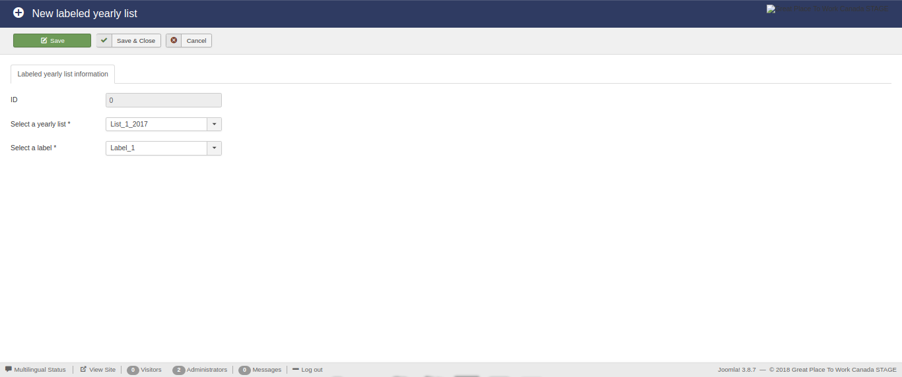
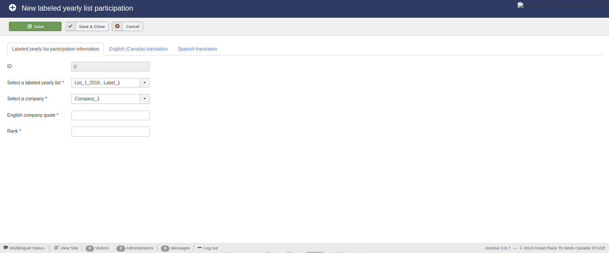

Database entries
================

The available database entries that constitute the component are displayed below:

* Affiliates

* Companies

* Lists

* List Categories

* Yearly lists

* Yearly list labels

* Labeled yearly lists

* Labeled yearly list participations

Display existing entries
------------------------

Affiliates
^^^^^^^^^^

This view presents the available affiliates.

.. image:: db_entries_affiliates.png
   :scale: 50 %
   :alt: Affiliates
   :align: center

Companies
^^^^^^^^^

The view presenting the available companies.

Lists
^^^^^

The view presenting the available lists.

.. image:: db_entries_lists.png
   :scale: 50 %
   :alt: Lists
   :align: center

List categories
^^^^^^^^^^^^^^^

The view presenting the available list categories.

.. image:: db_entries_list_categories.png
   :scale: 50 %
   :alt: List categories
   :align: center

Yearly lists
^^^^^^^^^^^^

The view presenting the available yearly lists.

.. image:: db_entries_yearly_lists.png
   :scale: 50 %
   :alt: Yearly lists
   :align: center

Yearly list labels
^^^^^^^^^^^^^^^^^^

The view presenting the available yearly list labels.

.. image:: db_entries_yearly_list_labels.png
   :scale: 50 %
   :alt: Yearly list labels
   :align: center

Labeled yearly lists
^^^^^^^^^^^^^^^^^^^^

The view presenting the available labeled yearly lists.

.. image:: db_entries_labeled_yearly_lists.png
   :scale: 50 %
   :alt: Labeled yearly lists
   :align: center

Labeled yearly list participations
^^^^^^^^^^^^^^^^^^^^^^^^^^^^^^^^^^

The view presenting the available labeled yearly list participations.

.. image:: db_entries_labeled_yearly_list_participations.png
   :scale: 50 %
   :alt: Labeled yearly list participations
   :align: center

Edit/create entries
-------------------

Except for the views that display the existing database entries, the functionality exists to create new and edit existing database enties. 

For this reason, a number of buttons and the necessary functions have been created in the previous views. 
These buttons are:

* New

* Edit

* Delete

In the following subsections the edit/create view of each type of entries is analyzed. 

Affiliates
^^^^^^^^^^

This view enables the editing of the available affiliates.
This form is simple.
It contains two fields:

* ID, and

* Name

.. image:: db_entries_edit_affiliate.png
   :scale: 50 %
   :alt: Affiliates
   :align: center

Companies
^^^^^^^^^

This view enables the editing of the available companies.

.. image:: db_entries_edit_company.png
   :scale: 50 %
   :alt: Companies
   :align: center

Lists
^^^^^

This view enables the editing of the available lists.

.. image:: db_entries_edit_list.png
   :scale: 50 %
   :alt: Lists
   :align: center

List categories
^^^^^^^^^^^^^^^

This view enables the editing of the available list categories.

.. image:: db_entries_edit_list_category.png
   :scale: 50 %
   :alt: List categories
   :align: center

Yearly lists
^^^^^^^^^^^^

The view presenting the available yearly lists.

Yearly list labels
^^^^^^^^^^^^^^^^^^

This view enables the editing of the available yearly list labels.

Labeled yearly lists
^^^^^^^^^^^^^^^^^^^^

This view enables the editing of the available labeled yearly lists.

.. image:: db_entries_edit_labeled_yearly_list.png
   :scale: 50 %
   :alt: Labeled yearly lists
   :align: center

Labeled yearly list participations
^^^^^^^^^^^^^^^^^^^^^^^^^^^^^^^^^^

This view enables the editing of the available labeled yearly list participations.

