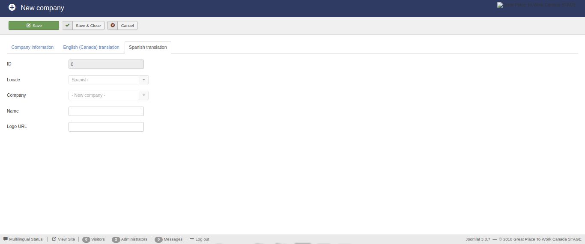
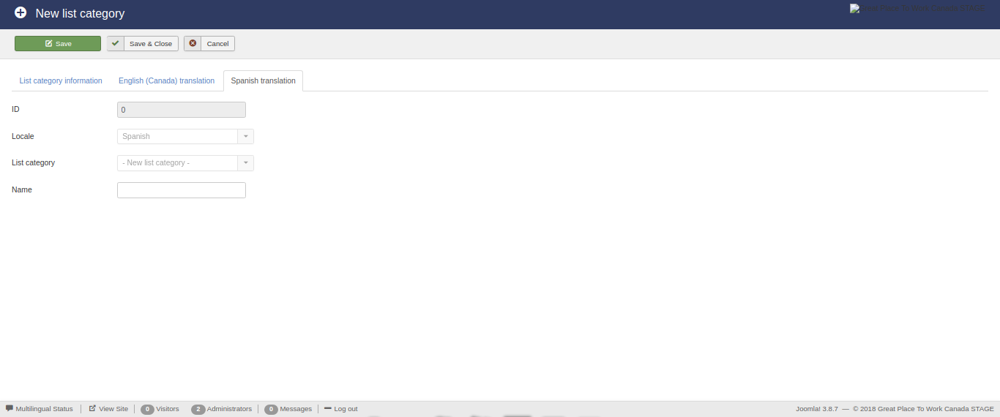
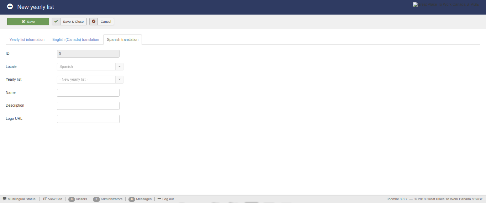
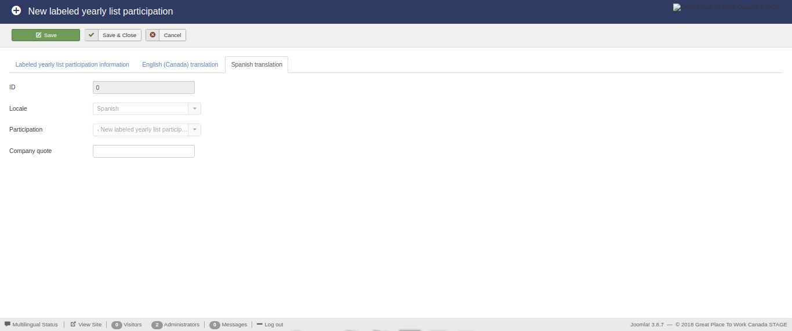

Database entries
================

The available database entries that constitute the component are displayed below:

* **Affiliates**

* **Companies**

* **Lists**

* **List Categories**

* **Yearly lists**

* **Yearly list labels**

* **Labeled yearly lists**

* **Labeled yearly list participations**

Display existing entries
------------------------

The initial view of this component consists of three main areas:

* The **side menu**,

* The **actions bar**, and 

* The **list**.

The **side menu** contains the types of database entries that exist.

The **list** displays the entries that exist in the database. 
Also this area contains a search, filtering and ordering mechanism which enables the use to display a subset of the total database entries.
Furthermore, each type of database entries is subject to different variables and as a result the corresponding **list** area contains different filtering and ordering options.

The **action bar** contains the buttons for manipulating the selected entries from **list** area.

Affiliates
^^^^^^^^^^

This view presents the available **affiliates**.

The **search** functonality is enabled for all the displayed fields.

There are no availbale **filtering** options.

The availbale **ordering** option are:

* **ID** (*ascending*/*descending*), and 

* **Name** (*ascending*/*descending*).

.. image:: db_entries_affiliates.png
   :scale: 50 %
   :alt: Affiliates
   :align: center

Companies
^^^^^^^^^

This view presents the available **companies**.

The **search** functonality is enabled for all the displayed fields.

The availbale **filtering** option are:

* **Parent company**

The availbale **ordering** option are:

* **ID** (*ascending*/*descending*),

* **Name** (*ascending*/*descending*),

* **Industry** (*ascending*/*descending*),

* **Parent company** (*ascending*/*descending*),

* **Salesforce ID** (*ascending*/*descending*),

* **Location** (*ascending*/*descending*),

* **Logo image** (*ascending*/*descending*),

* **Banner image** (*ascending*/*descending*),and

* **Website URL** (*ascending*/*descending*).

.. image:: db_entries_companies.png
   :scale: 50 %
   :alt: Companies
   :align: center

Lists
^^^^^

This view presents the available **lists**.

The **search** functonality is enabled for all the displayed fields.

The availbale **filtering** option are:

* **Category**,

* **State**, and

* **Owner affiliate**.

The availbale **ordering** option are:

* **ID** (*ascending*/*descending*),

* **Name** (*ascending*/*descending*),

* **Description** (*ascending*/*descending*),

* **Category** (*ascending*/*descending*),

* **Owner affiliate** (*ascending*/*descending*),

* **Ordering** (*ascending*/*descending*),and

* **State** (*ascending*/*descending*).

List categories
^^^^^^^^^^^^^^^

This view presents the available **list categories**.

The **search** functonality is enabled for all the displayed fields.

There are no availbale **filtering** options.

The availbale **ordering** option are:

* **ID** (*ascending*/*descending*),

* **Name** (*ascending*/*descending*), and 

* **Ordering** (*ascending*/*descending*).

.. image:: db_entries_list_categories.png
   :scale: 50 %
   :alt: List categories
   :align: center

Yearly lists
^^^^^^^^^^^^

This view presents the available **yearly lists**.

The **search** functonality is enabled for all the displayed fields.

The availbale **filtering** option are:

* **List**,

* **State**,

* **Owner affiliate**,

* **Start date**, and

* **End date**.

The availbale **ordering** option are:

* **ID** (*ascending*/*descending*),

* **List** (*ascending*/*descending*),

* **Year** (*ascending*/*descending*),

* **Name** (*ascending*/*descending*),

* **Description** (*ascending*/*descending*),

* **Logo image** (*ascending*/*descending*),

* **Banner image** (*ascending*/*descending*),

* **Publication date** (*ascending*/*descending*),

* **Certification date** (*ascending*/*descending*),and

* **State** (*ascending*/*descending*).

Yearly list labels
^^^^^^^^^^^^^^^^^^

This view presents the available **yearly list labels**.

The **search** functonality is enabled for all the displayed fields.

There are no availbale **filtering** options.

The availbale **ordering** option are:

* **ID** (*ascending*/*descending*),

* **Name** (*ascending*/*descending*), and 

* **Ordering** (*ascending*/*descending*).

Labeled yearly lists
^^^^^^^^^^^^^^^^^^^^

This view presents the available **labeled yearly lists**.

The **search** functonality is enabled for all the displayed fields.

The availbale **filtering** option are:

* **Yearly list**,

* **Label**, and

* **Owner affiliate**.

The availbale **ordering** option are:

* **ID** (*ascending*/*descending*),

* **Yearly list** (*ascending*/*descending*), and

* **Label** (*ascending*/*descending*).

Labeled yearly list participations
^^^^^^^^^^^^^^^^^^^^^^^^^^^^^^^^^^

This view presents the available **labeled yearly list participations**.

The **search** functonality is enabled for all the displayed fields.

The availbale **filtering** option are:

* **Yearly list**,

* **Label**,

* **Company**, and

* **Owner affiliate**.

The availbale **ordering** option are:

* **ID** (*ascending*/*descending*),

* **Yearly list** (*ascending*/*descending*),

* **Label** (*ascending*/*descending*),

* **Company** (*ascending*/*descending*),

* **Quote** (*ascending*/*descending*), and

* **Rank** (*ascending*/*descending*).

.. image:: db_entries_labeled_yearly_list_participations.png
   :scale: 50 %
   :alt: Labeled yearly list participations
   :align: center

Edit/create entries
-------------------

Except for the views that display the existing database entries, the functionality exists to **create new** and **edit existing** database enties. 

For this reason, a number of buttons and the necessary functions have been created in the previous views. 
These buttons are:

* **New**

* **Edit**

* **Delete**

In the following subsections the edit/create view of each type of entries is analyzed. 

Affiliates
^^^^^^^^^^

This view enables the editing of the available **affiliates**.

The form contains the following fields:

* **ID**, and

* **Name**.

The **ID** field is *auto-filled* and *auto-generated*.

The **Name** field is required and must be less than *190 characters*.

.. image:: db_entries_edit_affiliate.png
   :scale: 50 %
   :alt: Affiliate
   :align: center

Companies
^^^^^^^^^

This view enables the editing of the available **companies**.

The form contains the following fields:

* **ID**,

* **English name**,

* **Salesforce ID**,

* **Parent company**,

* **Location**,

* **Industry**,

* **English logo URL**,

* **Banner image**, and

* **Website**.

The **ID** field is *auto-filled* and *auto-generated*.

The **English name** field is required and must be less than *255 characters*.

The **Salesforce ID** field is required and must be less than *18 characters*. 

The **Parent company** field is required and can selected from a drop down list containnig the existing companies.

The **Location** field required and must be of type text.

The **Industry ID** field is required and can selected from a drop down list containnig the existing industries.

The **English Logo URL** field is required and must be of type text.

The **Banner image** field is required and must be of type text.

The **Website** field is required and must be of type text.

.. image:: db_entries_edit_company.png
   :scale: 50 %
   :alt: Company
   :align: center

Furthermore, this form contains multiple *auto-generated* **translation sub-forms** for each of the languages associated with the affiliate of the logged user!
Each **translation sub-form** contains the following fields:

* **ID**,

* **Locale**,

* **Company**,

* **Name**, and

* **Logo URL**.

The **ID** field is *auto-filled* and *auto-generated*.

The **Locale** field is *auto-filled* based on the language locale associated with the affiliate of the user.

The **Company** field is *auto-filled* based on the current company.

The **Name** field must be less than *255 characters*.

The **Logo URL** field must be of type text.

Lists
^^^^^

This view enables the editing of the available **lists**.

The form contains the following fields:

* **ID**,

* **English name**,

* **English description**,

* **Category**,

* **Owner affiliate**,

* **Ordering**, and

* **State**.

The **ID** field is *auto-filled* and *auto-generated*.

The **English name** field is required and must be less than *255 characters*.

The **English description** field is required and must be of type text.

The **Category** field is required and can be selected from a drop down list containnig the existing category.

The **Owner affiliate** field is required and can be selected from a drop down list containnig the existing affiliates.

The **Ordering** field is required and must be an integer.

The **State** field is required and must be an integer.

.. image:: db_entries_edit_list.png
   :scale: 50 %
   :alt: List
   :align: center

Furthermore, this form contains multiple *auto-generated* **translation sub-forms** for each of the languages associated with the affiliate of the logged user!
Each **translation sub-form** contains the following fields:

* **ID**,

* **Locale**,

* **List**,

* **Name**, and

* **Description**.

The **ID** field is *auto-filled* and *auto-generated*.

The **Locale** field is *auto-filled* based on the language locale associated with the affiliate of the user.

The **List** field is *auto-filled* based on the current list.

The **Name** field must be less than *255 characters*.

The **Description** field must be of type text.

List categories
^^^^^^^^^^^^^^^

This view enables the editing of the available **list categories**.

The form contains the following fields:

* **ID**,

* **English name**, and

* **Ordering**.

The **ID** field is *auto-filled* and *auto-generated*.

The **English name** field is required and must be less than *190 characters*.

The **Ordering** field is required and must be an integer.

   
Furthermore, this form contains multiple *auto-generated* **translation sub-forms** for each of the languages associated with the affiliate of the logged user!
Each **translation sub-form** contains the following fields:

* **ID**,

* **Locale**,

* **List category**, and

* **Name**.

The **ID** field is *auto-filled* and *auto-generated*.

The **Locale** field is *auto-filled* based on the language locale associated with the affiliate of the user.

The **List category** field is *auto-filled* based on the current list category.

The **Name** field must be less than *255 characters*.

Yearly lists
^^^^^^^^^^^^

This view enables the editing of the available **yearly lists**.

The form contains the following fields:

* **ID**,

* **List**,

* **Year**,

* **English name**,

* **English description**,

* **English logo URL**,

* **Banner image**,

* **Publication date**,

* **Certification date**, and

* **State**, and

* **Methodology**.

The **ID** field is *auto-filled* and *auto-generated*.

The **List** field is required and can be selected from a drop down list containnig the existing lists.

The **Year** field is required and must be an integer.

The **English name** field is required and must be less than *255 characters*.

The **English description** field is required and must be of type text.

The **English logo URL** field is required and must be of type text.

The **Banner image** field is required and must be of type text.

The **Publication date** field is required and must be a date.

The **Certification date** field is required and must be a date.

The **State** field is required and must be an integer.

The **Methodology** field is required and must be of type text.

.. image:: db_entries_edit_yearly_list.png
   :scale: 50 %
   :alt: Yearly list
   :align: center

Furthermore, this form contains multiple *auto-generated* **translation sub-forms** for each of the languages associated with the affiliate of the logged user!
Each **translation sub-form** contains the following fields:

* **ID**,

* **Locale**,

* **Yearly list**,

* **Name**, 

* **Description**, and

* **Logo URL**.

The **ID** field is *auto-filled* and *auto-generated*.

The **Locale** field is *auto-filled* based on the language locale associated with the affiliate of the user.

The **Yearly list** field is *auto-filled* based on the current yearly list.

The **Name** field must be less than *255 characters*.

The **Description** field must be of type text.

The **Logo URL** field must be of type text.

Yearly list labels
^^^^^^^^^^^^^^^^^^

This view enables the editing of the available **yearly list labels**.

The form contains the following fields:

* **ID**,

* **English name**, and

* **Ordering**.

The **ID** field is *auto-filled* and *auto-generated*.

The **English name** field is required and must be less than *190 characters*.

The **Ordering** field is required and must be an integer.

.. image:: db_entries_edit_yearly_list_label.png
   :scale: 50 %
   :alt: Yearly list label
   :align: center
   
Furthermore, this form contains multiple *auto-generated* **translation sub-forms** for each of the languages associated with the affiliate of the logged user!
Each **translation sub-form** contains the following fields:

* **ID**,

* **Locale**,

* **Yearly list label**, and

* **Name**.

The **ID** field is *auto-filled* and *auto-generated*.

The **Locale** field is *auto-filled* based on the language locale associated with the affiliate of the user.

The **Yearly list label** field is *auto-filled* based on the current list category.

The **Name** field must be less than *255 characters*.

Labeled yearly lists
^^^^^^^^^^^^^^^^^^^^

This view enables the editing of the available **labeled yearly lists**.

The form contains the following fields:

* **ID**,

* **Yearly list**, and

* **Label**.

The **ID** field is *auto-filled* and *auto-generated*.

The **Yearly list** field is required and can be selected from a drop down list containnig the existing yearly lists.

The **Label** field is required and can be selected from a drop down list containnig the existing labels.

Labeled yearly list participations
^^^^^^^^^^^^^^^^^^^^^^^^^^^^^^^^^^

This view enables the editing of the available **labeled yearly list participations**.

The form contains the following fields:

* **ID**,

* **Labeled yearly list**,

* **Company**,

* **English company quote**, and

* **Rank**.

The **ID** field is *auto-filled* and *auto-generated*.

The **Labeled yearly list** field is required and can be selected from a drop down list containnig the existing labeled yearly lists.

The **Company** field is required and can be selected from a drop down list containnig the existing companies.

The **English company quote** field is required and must be of type text.

The **Rank** field is required and must be an integer.

.. image:: db_entries_edit_labeled_yearly_list_participation.png
   :scale: 50 %
   :alt: Labeled yearly list participation
   :align: center

Furthermore, this form contains multiple *auto-generated* **translation sub-forms** for each of the languages associated with the affiliate of the logged user!
Each **translation sub-form** contains the following fields:

* **ID**,

* **Locale**,

* **Labeled yearly list participation**, and

* **Company quote**.

The **ID** field is *auto-filled* and *auto-generated*.

The **Locale** field is *auto-filled* based on the language locale associated with the affiliate of the user.

The **Labeled yearly list participation** field is *auto-filled* based on the current labeled yearly list participation.

The **Company quote** field must be of type text.

