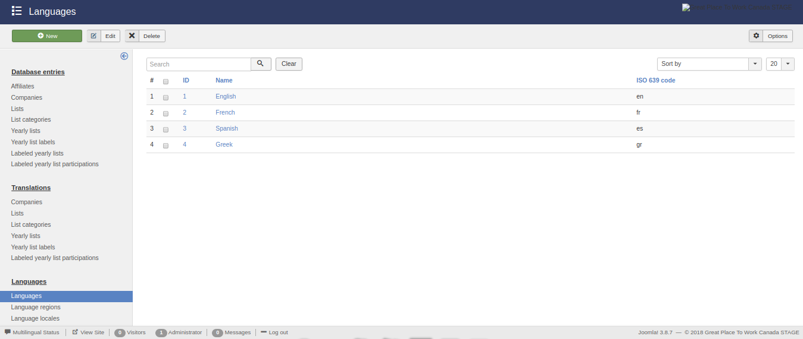
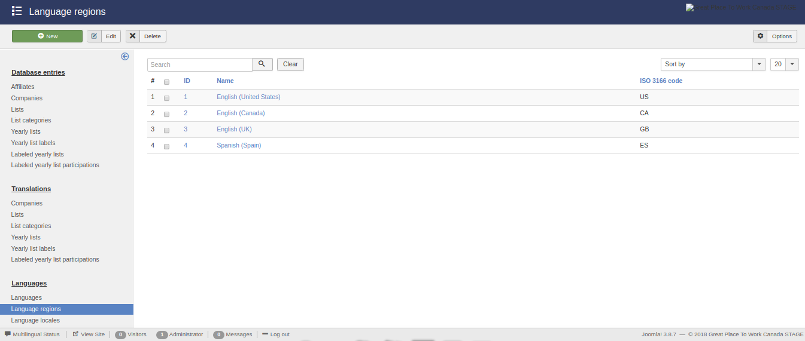
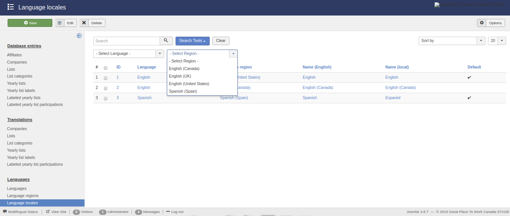
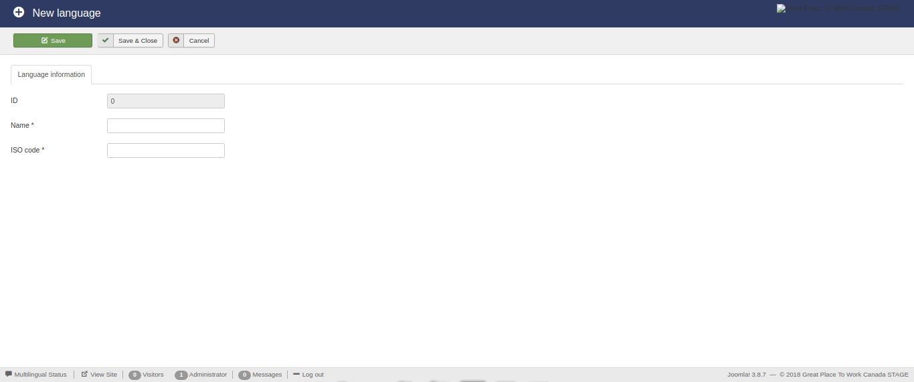
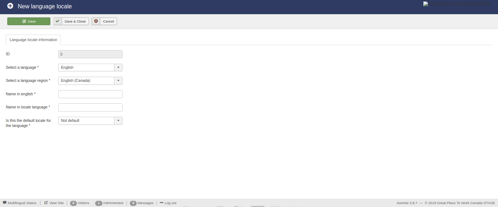

Languages
=========

Display existing languages
--------------------------

The initial view of this component consists of three main areas:

* The **side menu**,

* The **actions bar**, and 

* The **list**.

The **side menu** contains the types of languages that exist.

The **list** displays the languages that exist in the database. 
Also this area contains a search, filtering and ordering mechanism which enables the use to display a subset of the total languages.
Furthermore, each type of language is subject to different variables and as a result the corresponding **list** area contains different filtering and ordering options.

The **action bar** contains the buttons for manipulating the selected languages from **list** area.

Languages
^^^^^^^^^

This view presents the available **languages**.

The **search** functonality is enabled for all the displayed fields.

There are no availbale **filtering** options.

The availbale **ordering** option are:

* **ID** (*ascending*/*descending*),

* **Name** (*ascending*/*descending*), and

* **ISO code** (*ascending*/*descending*).

Regions
^^^^^^^

This view presents the available **language regions**.

The **search** functonality is enabled for all the displayed fields.

There are no availbale **filtering** options.

The availbale **ordering** option are:

* **ID** (*ascending*/*descending*),

* **Name** (*ascending*/*descending*), and

* **ISO code** (*ascending*/*descending*).

Locales
^^^^^^^

This view presents the available **language locales**.

The **search** functonality is enabled for all the displayed fields.

The availbale **filtering** option are:

* **Language**, and

* **Region**.

The availbale **ordering** option are:

* **ID** (*ascending*/*descending*),

* **Name** (*ascending*/*descending*),

* **Local name** (*ascending*/*descending*),

* **Language** (*ascending*/*descending*),

* **Region** (*ascending*/*descending*), and

* **Default state** (*ascending*/*descending*).

Edit/create languages
---------------------

Except for the views that display the existing languages, the functionality exists to **create new** and **edit existing** database enties. 

For this reason, a number of buttons and the necessary functions have been created in the previous views. 
These buttons are:

* **New**

* **Edit**

* **Delete**

In the following subsections the edit/create view of each type of entries is analyzed. 

Languages
^^^^^^^^^

This view enables the editing of the available **languages**.

The form contains the following fields:

* **ID**, 

* **Name**, and

* **ISO code**.

The **ID** field is *auto-filled* and *auto-generated*.

The **Name** field is required and must be less than *255 characters*.

The **ISO code** field is required and must be less than *3 characters*.
Also the **ISO code** must be the appropriate language code according to the **iso_639_1** naminig system.

Regions
^^^^^^^

This view enables the editing of the available **language regions**.

The form contains the following fields:

* **ID**, 

* **Name**, and

* **ISO code**.

The **ID** field is *auto-filled* and *auto-generated*.

The **Name** field is required and must be less than *255 characters*.

The **ISO code** field is required and must be less than *3 characters*.
Also the **ISO code** must be the appropriate language code according to the **iso_3166_1** naminig system.

Locales
^^^^^^^

This view enables the editing of the available **languages**.

The form contains the following fields:

* **ID**, 

* **Language**,

* **Region**,

* **English name**,

* **Local name**, and

* **Default state**.

The **ID** field is *auto-filled* and *auto-generated*.

The **Language** field is required and can selected from a drop down list containnig the existing languages.

The **Region** field is required and can selected from a drop down list containnig the existing language regions.

The **English name** field is required and must be less than *255 characters*.

The **Local name** field is required and must be less than *190 characters*.

The **Defaul state** field is required and must be an integer with values "0" or "1".

