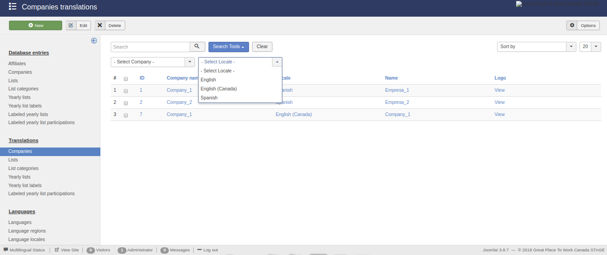
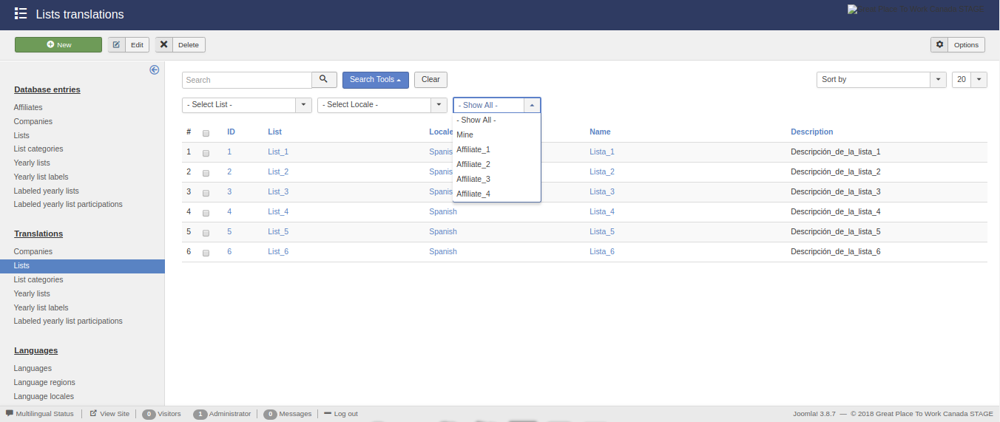
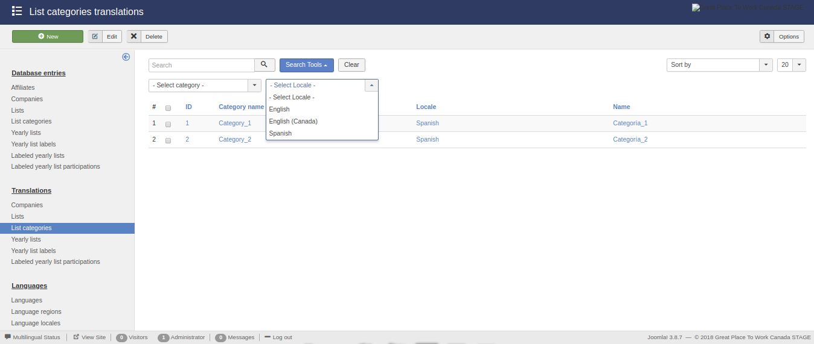
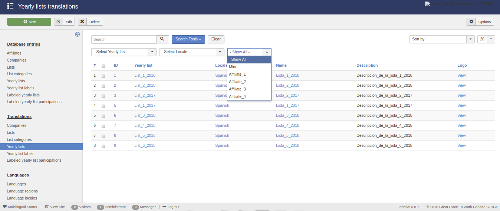
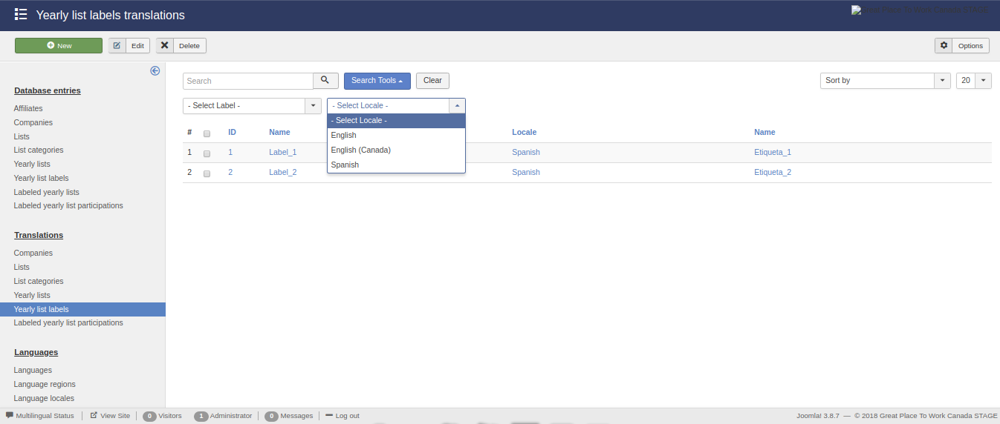
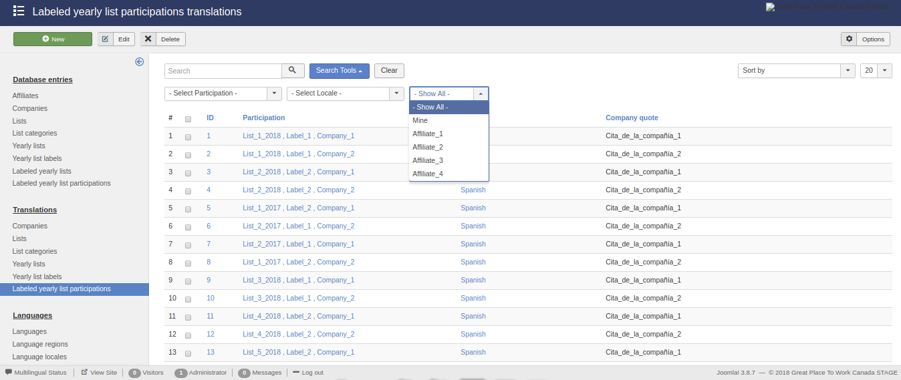

Translations
============

The available translations available for the component are displayed below:

* Companies

* Lists

* List Categories

* Yearly lists

* Yearly list labels

* Labeled yearly list participations

Companies
---------

The translations linked to the available companies.

Lists
-----

The translations linked to the available lists.

List categories
---------------

The translations linked to the available list categories.

Yearly lists
------------

The translations linked to the available yearly lists.

Yearly list labels
------------------

The translations linked to the available yearly list labels.

Labeled yearly list participations
----------------------------------

The translations linked to the available labeled yearly list participations.

