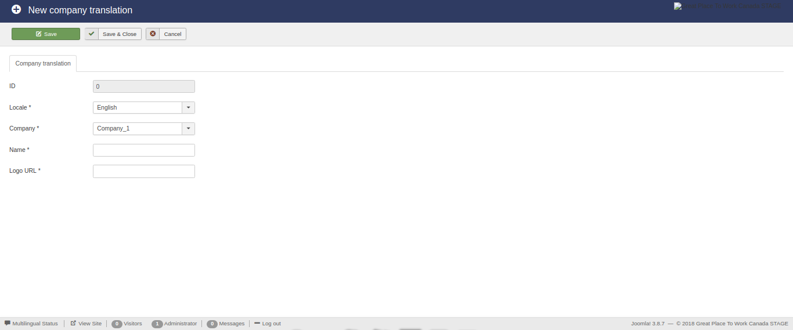
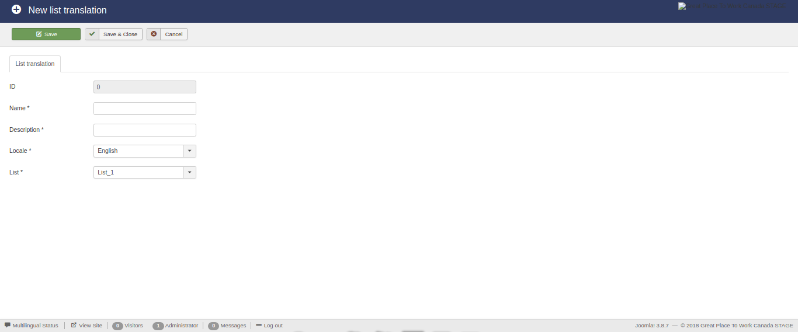
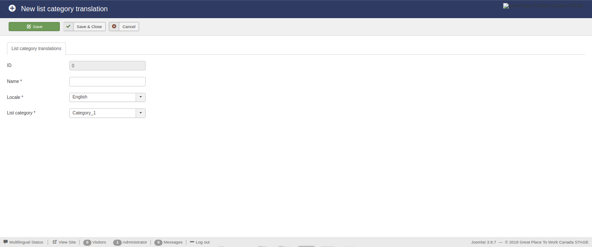
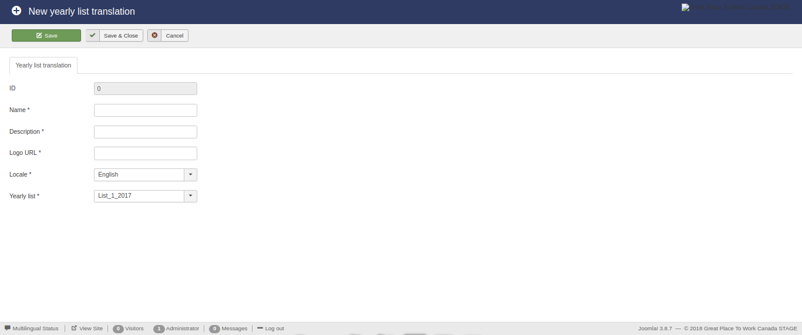
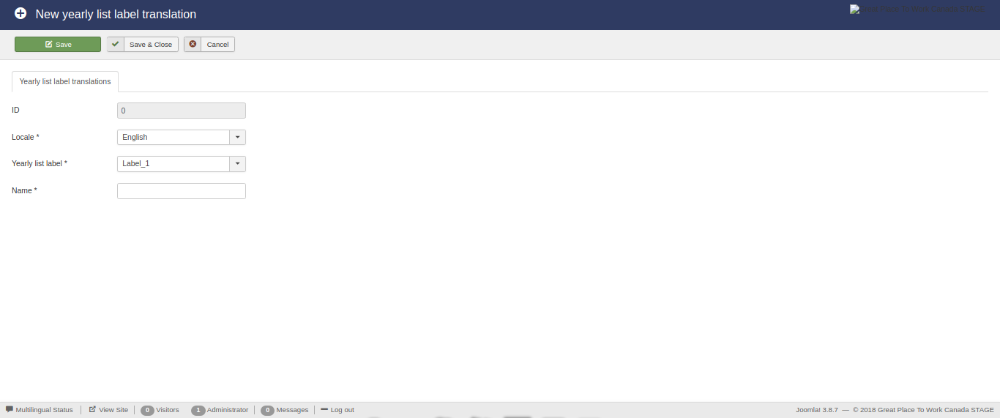
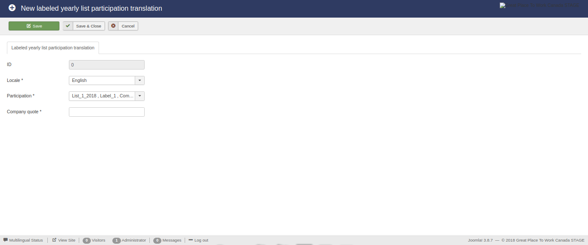

Translations
============

The available translations available for the component are displayed below:

* **Companies**

* **Lists**

* **List Categories**

* **Yearly lists**

* **Yearly list labels**

* **Labeled yearly list participations**

Display existing translations
-----------------------------

The initial view of this component consists of three main areas:

* The **side menu**,

* The **actions bar**, and 

* The **list**.

The **side menu** contains the types of database entries that exist.

The **list** displays the translations that exist in the database. 
Also this area contains a search, filtering and ordering mechanism which enables the use to display a subset of the total translations.
Furthermore, each type of translations is subject to different variables and as a result the corresponding **list** area contains different filtering and ordering options.

The **action bar** contains the buttons for manipulating the selected entries from **list** area.

Companies
^^^^^^^^^

The translations linked to the available **companies**.

The **search** functonality is enabled for all the displayed fields.

The availbale **filtering** option are:

* **Company**, and

* **Locale**

The availbale **ordering** option are:

* **ID** (*ascending*/*descending*),

* **Name** (*ascending*/*descending*),

* **Company** (*ascending*/*descending*),

* **Locale** (*ascending*/*descending*),

* **Logo image** (*ascending*/*descending*).

.. image:: translations_companies.png
   :scale: 50 %
   :alt: Companies
   :align: center

Lists
^^^^^

The translations linked to the available **lists**.

The **search** functonality is enabled for all the displayed fields.

The availbale **filtering** option are:

* **Locale**,

* **List**, and

* **Owner affiliate**.

The availbale **ordering** option are:

* **ID** (*ascending*/*descending*),

* **Name** (*ascending*/*descending*),

* **Description** (*ascending*/*descending*),

* **List** (*ascending*/*descending*), and

* **Locale** (*ascending*/*descending*).

.. image:: translations_lists.png
   :scale: 50 %
   :alt: Lists
   :align: center

List categories
^^^^^^^^^^^^^^^

The translations linked to the available **list categories**.

The **search** functonality is enabled for all the displayed fields.

The availbale **filtering** option are:

* **Category**, and

* **Locale**.

The availbale **ordering** option are:

* **ID** (*ascending*/*descending*),

* **Name** (*ascending*/*descending*), 

* **Category** (*ascending*/*descending*), and 

* **Locale** (*ascending*/*descending*).

.. image:: translations_list_categories.png
   :scale: 50 %
   :alt: List categories
   :align: center

Yearly lists
^^^^^^^^^^^^

The translations linked to the available **yearly lists**.

The **search** functonality is enabled for all the displayed fields.

The availbale **filtering** option are:

* **Locale**,

* **Yearly list**, and

* **Owner affiliate**.

The availbale **ordering** option are:

* **ID** (*ascending*/*descending*),

* **Name** (*ascending*/*descending*),

* **Description** (*ascending*/*descending*),

* **Logo image** (*ascending*/*descending*),

* **Yearly list** (*ascending*/*descending*), and

* **Locale** (*ascending*/*descending*).

.. image:: translations_yearly_lists.png
   :scale: 50 %
   :alt: Yearly lists
   :align: center

Yearly list labels
^^^^^^^^^^^^^^^^^^

The translations linked to the available **yearly list labels**.

The **search** functonality is enabled for all the displayed fields.

The availbale **filtering** option are:

* **Label**, and

* **Locale**.

The availbale **ordering** option are:

* **ID** (*ascending*/*descending*),

* **Name** (*ascending*/*descending*), 

* **Label** (*ascending*/*descending*), and 

* **Locale** (*ascending*/*descending*).

.. image:: translations_yearly_list_labels.png
   :scale: 50 %
   :alt: Yearly list labels
   :align: center

Labeled yearly list participations
^^^^^^^^^^^^^^^^^^^^^^^^^^^^^^^^^^

The translations linked to the available **labeled yearly list participations**.

The **search** functonality is enabled for all the displayed fields.

The availbale **filtering** option are:

* **Locale**,

* **Labeled yearly list participation**, and

* **Owner affiliate**.

The availbale **ordering** option are:

* **ID** (*ascending*/*descending*),

* **Labled yearly list participation** (*ascending*/*descending*),

* **Company quote** (*ascending*/*descending*), and

* **Locale** (*ascending*/*descending*).

.. image:: translations_labeled_yearly_list_participations.png
   :scale: 50 %
   :alt: Labeled yearly list participations
   :align: center

Edit/create translations
------------------------

Except for the views that display the existing translations, the functionality exists to **create new** and **edit existing** translations. 

For this reason, a number of buttons and the necessary functions have been created in the previous views. 
These buttons are:

* **New**

* **Edit**

* **Delete**

In the following subsections the edit/create view of each type of entries is analyzed. 

Companies
^^^^^^^^^

The translation of a **company**.

Lists
^^^^^

The translation of **list**.

List categories
^^^^^^^^^^^^^^^

The translation of a **list category**.

Yearly lists
^^^^^^^^^^^^

The translation of a **yearly list**.

Yearly list labels
^^^^^^^^^^^^^^^^^^

The translation of a **yearly list label**.

Labeled yearly list participations
^^^^^^^^^^^^^^^^^^^^^^^^^^^^^^^^^^

The translation of a **labeled yearly list participations**.

