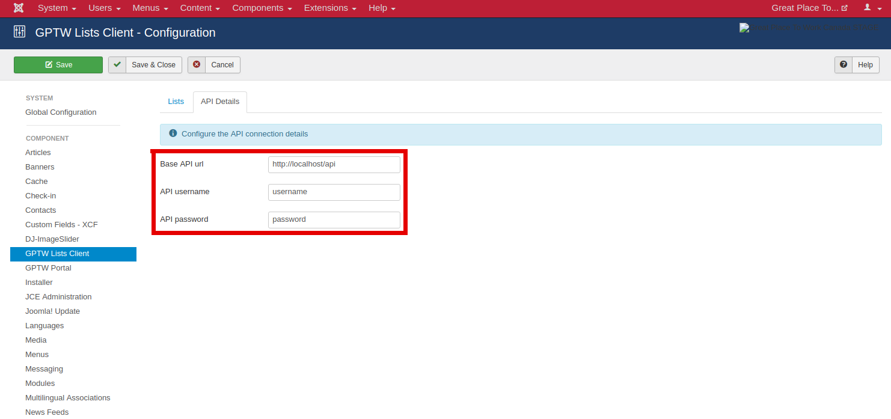
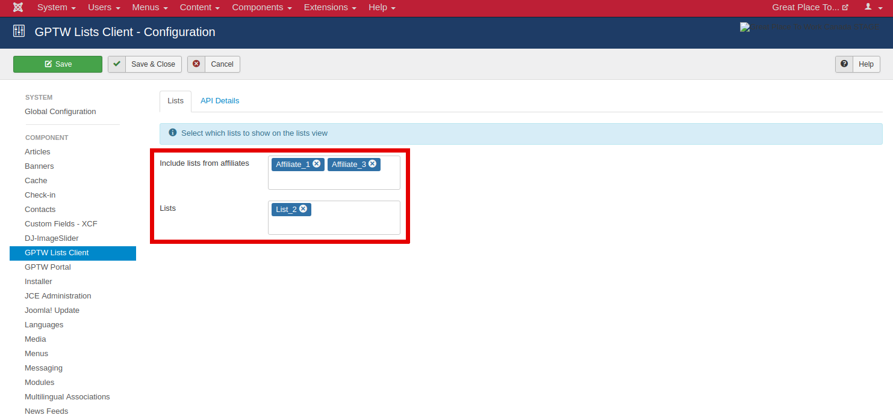

Configuration
=============

The frontend component can be configured through the configuration menu in the backend of the Joomla website. This menu is contains two tabs:

* **API**, and

* **Lists**.

API configuration
-----------------

The API configuration options are required for all the functionalities of the frontend component. The dollowing fields are present under the **API** tab:

* **Base API url**,

* **Username**, and 

* **Password**.

Based on the login credentials the component builds the API request and send it to the main backend server. After the validation of the credentials the main server responds with the requested data.

List selection
--------------

A subset of the total available lists can be selected in the backend configuration of the frontend component.

This subset can be formed by selecting:

* Lists that are owned by certain **affiliates**, and/or 

* Specific **lists**.

