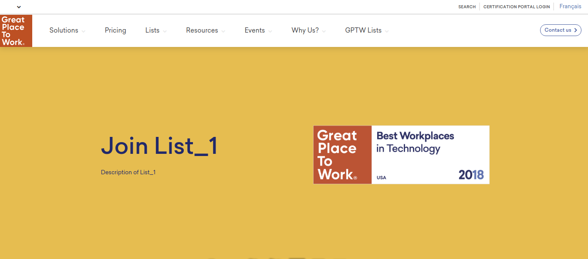
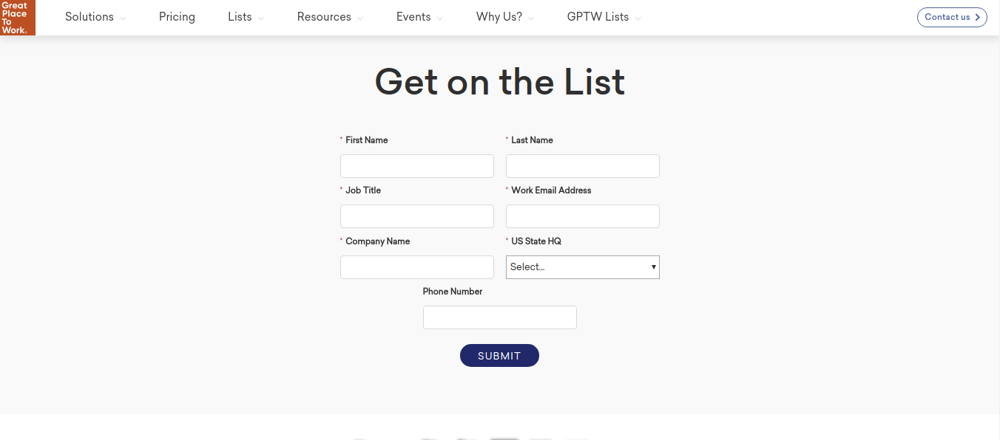
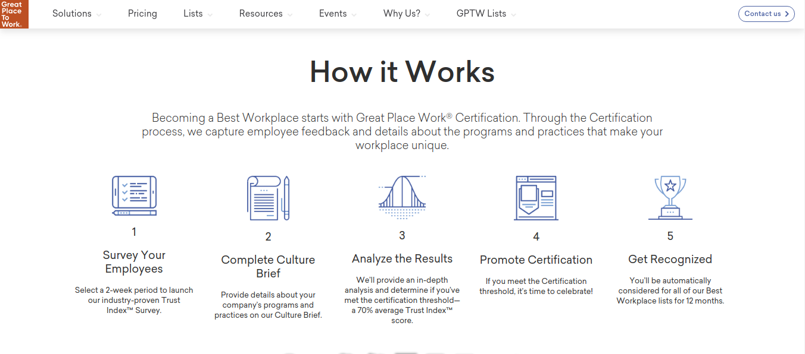
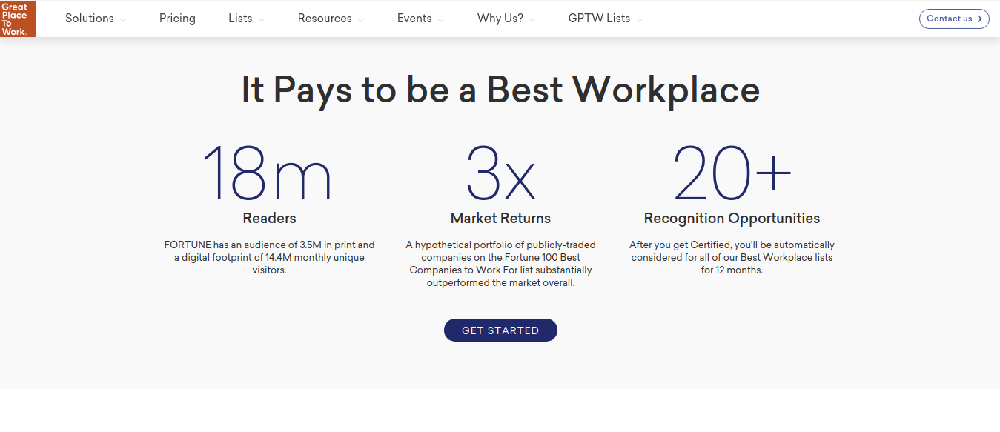
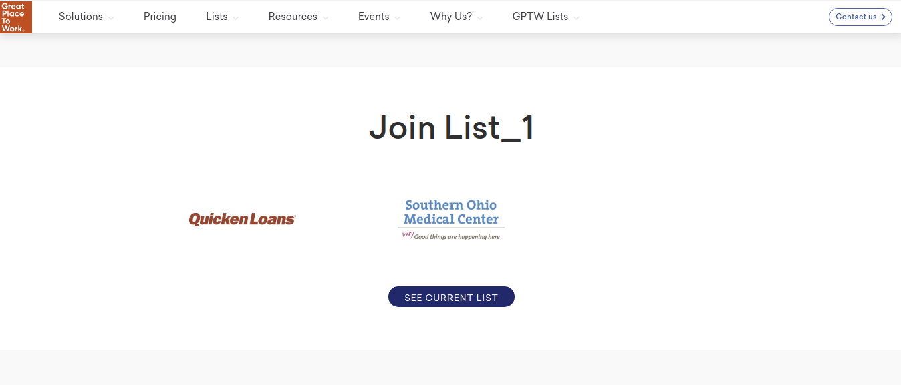
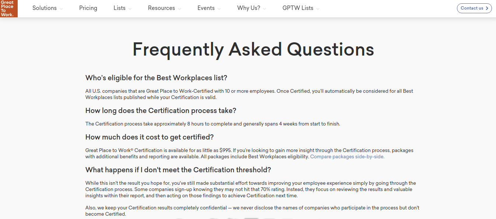

List view
=========

The list details are presented in this part of the fronend component.

Content
-------

The content of the yearly list view page is structured as follows:

* **Banner**. The basic information of the list are presented alongside the logo image.

* **Get on the list**. A form to subscribe on the list is displayed.

* **How it works**. Some usefull information are presented in order to demostrate the workflow of the services provided.

* **It pays to be a best workplace**. The benefits of subscribing are summarized and some statistics are highlighted.

* **Join**. A view of companies subscribed on the current list are displayed alongside the link to the latest yearly list that belongs to the current list.

* **Frequently asked questions**. Frequently asked asked questions are answered in order to aid the customers.

Banner
^^^^^^

The first part of this page is occupied by a banner area.
This area consists of the information concerning the current yearly list, such as:

* The **logo** of the yearly list,

* The **name** of the yearly list, and

* The **description** of the yearly list.

Get on the list
^^^^^^^^^^^^^^^

How it works
^^^^^^^^^^^^

It pays to be a best workplace
^^^^^^^^^^^^^^^^^^^^^^^^^^^^^^

Join
^^^^

Frequently asked questions
^^^^^^^^^^^^^^^^^^^^^^^^^^

