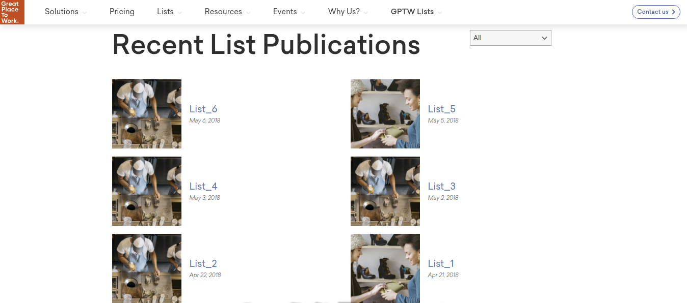

Lists view
==========

A selection of the available lists are presented in this part of the fronend component.

List selection
--------------

A subset of the total available lists can be selected in the backend configuration of the frontend component.

This subset can be formed by selecting:

* Lists that are owned by certain **affiliates**, and/or 

* Specific **lists**.

.. image:: lists_configuration.png
   :scale: 50 %
   :alt: Configuraion
   :align: center

Features
--------

The basic features provided in this page are presented in this section.

Filtering
^^^^^^^^^

The user is offered the capability to filter the presented lists by the **category** they belong to.

Layouts
-------

There functionality to create different layouts has been developed in order to provide a personalized experience.
Two layouts are available so far for demponstration purposes:

* **Default** and

* **Single column**.

Default
^^^^^^^

In this design the lists are presented in **two columns** starting from the top left and ordered **chronologically** from latest to oldest. 

Single column
^^^^^^^^^^^^^

In this design the lists are presented in a **single column** and again they are ordered **chronologically** from latest to oldest. 

