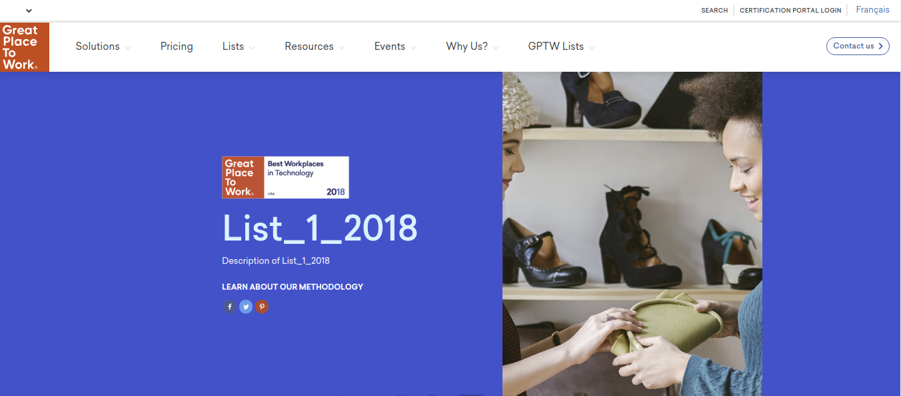
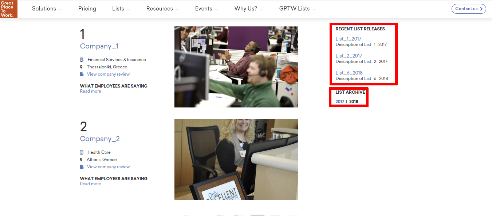

Yearly list view
================

The yearly list details are presented in this part of the fronend component.

Content
-------

Banner
^^^^^^

The first part of this page is occupied by a banner area.
This area consists of the information concerning the current yearly list, such as:

* The logo of the yearly list,

* The name of the yearly list,

* The description of the yearly list, and

* The banner image of the yearly list.

Company participations
^^^^^^^^^^^^^^^^^^^^^^

The list of the companies that participated in the displayed yearly list are presented after the banner section.
The companies are listed according to the ranking they achieved.

The template used for each company contains the following information:

* The company's name,

* The company's indusrty,

* The company's location,

* A link to the company's great place to work reviews profile, and 

* The company's quote.

Other links
^^^^^^^^^^^

Some usefull links are placed next to the participations:

* Recent lists releases. This section presents a list of the most recently created yearly lists.

* List archive. In this section the yearly lists that belong in the curent list are chronologically listed.

Layouts
-------

