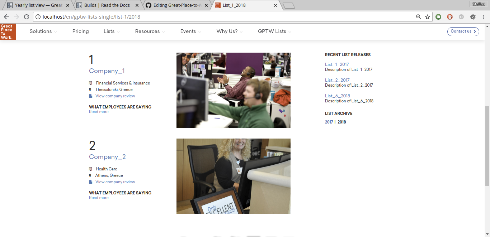
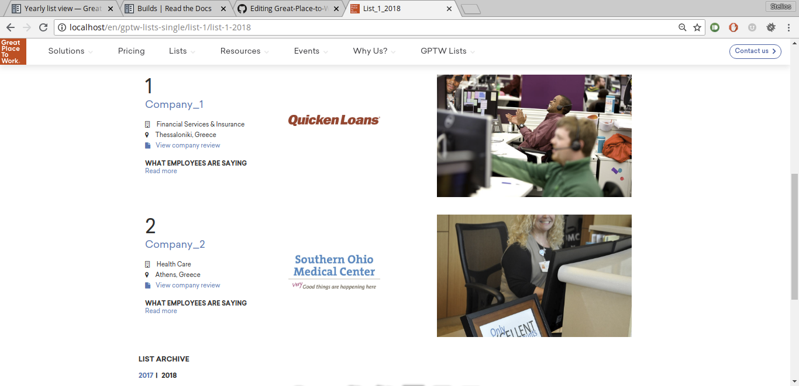

Yearly list view
================

The yearly list details are presented in this part of the fronend component.

Content
-------

The content of the yearly list view page is structured as follows:

* Banner. The basic information of the yearly list are presented alongside the logo and banner images.

* Company participations. The companies that participated in the current yearly list are presented according to their rank.

* Extra links. Some usefull links are included in this view in order to improve the users' experience.

Banner
^^^^^^

The first part of this page is occupied by a banner area.
This area consists of the information concerning the current yearly list, such as:

* The logo of the yearly list,

* The name of the yearly list,

* The description of the yearly list, and

* The banner image of the yearly list.

.. image:: yearly_list_view_1.png
   :scale: 50 %
   :alt: Yearly list view 1
   :align: center

Company participations
^^^^^^^^^^^^^^^^^^^^^^

The list of the companies that participated in the displayed yearly list are presented after the banner section.
The companies are listed according to the ranking they achieved.

The template used for each company contains the following information:

* The company's name,

* The company's indusrty,

* The company's location,

* A link to the company's great place to work reviews profile, and 

* The company's quote.

.. image:: yearly_list_view_2.png
   :scale: 50 %
   :alt: Yearly list view 2
   :align: center

Extra links
^^^^^^^^^^^

Some usefull links are placed next to the participations:

* Recent lists releases. This section presents a list of the most recently created yearly lists.

* List archive. In this section the yearly lists that belong in the curent list are chronologically listed.

Layouts
-------

There functionality to create different layouts has been developed in order to provide a personalized experience.
Two layouts are available so far for demponstration purposes:

* Default and

* Single column.

Default
^^^^^^^

In this design the company participations are presented in the right column and are ordered chronologically from latest to oldest. 
In the right column the the recent list releases and list archive section are displayed.

Single column
^^^^^^^^^^^^^

In this design the company participations are presented in a single column and are again ordered chronologically from the latest to the oldest.
The list archive section follows underneath. 

