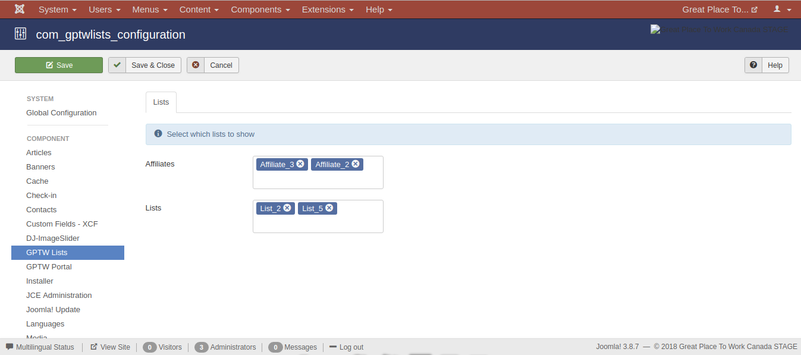
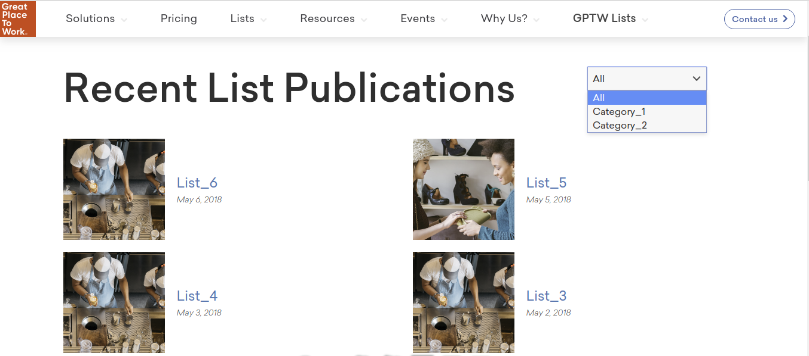

Lists view
==========

A selection of the available lists are presented in this part of the fronend component.

List selection
--------------

A subset of the total available lists can be selected in the backend configuration of the frontend component.

This subset can be formed by selecting:

* Lists that are owned by certain affiliates, and/or 

* Specific lists.

Features
--------

Filtering
^^^^^^^^^

The user is offered the capability to filter the presented lists by the category they belong to.

